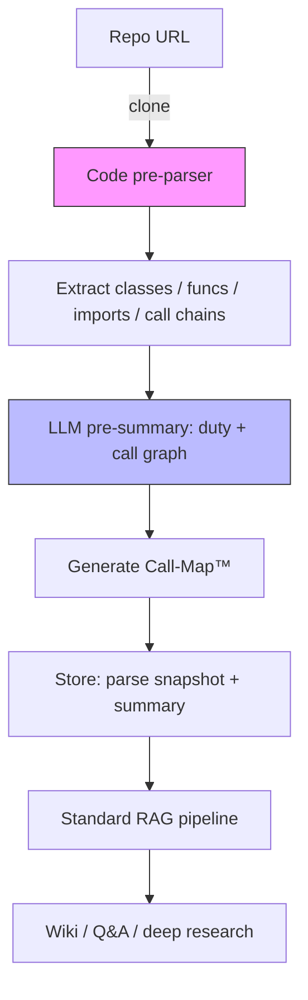

# DeepWiki-Plus 🚀  
> Elevate any repo’s doc experience from “usable” to “instantly clear”

DeepWiki-Plus is a **code-level, deeply-enhanced** evolution of the original DeepWiki.  
We kept the beloved “one-click beautiful Wiki” super-power, then inserted two **pre-parsing** and **pre-summarization** stages **before** the LLM ever sees the code.  
The result: higher accuracy, better readability, and lower maintenance for every page we generate.

[English](./README.md) | [简体中文](./README.zh.md) 
---

## ✨ Core Improvements (Exclusive)

| Step | Original DeepWiki | DeepWiki-Plus |
|---|---|---|
| ① Code fetch | plain clone | clone + **lightweight static analysis** |
| ② Semantic extraction | none | **code parsing**: classes, signatures, returns, imports, call chains |
| ③ Pre-summary | none | **LLM second-pass**: module duty + call-graph (Mermaid) |
| ④ Wiki generation | raw code context only | **pre-summary injected** → LLM answers ↑ accuracy, ↓ hallucination |
| ⑤ Q&A / deep-dive | RAG via Embedding only | RAG **+** pre-summary **dual retrieval**—complex call-chain questions answered instantly |

---

## 🎯 New Super-powers

1. **Call-Map™** – one-click call-chain graph  
   Every module opens with an auto-generated Mermaid diagram; click any node to jump to the exact source line.

2. **Smart-TOC™** – intelligent outline  
   Built from pre-summarized “module duties” so the wiki never shows empty sections or “misc” dumps.

3. **Private-Graph™** – internal-only highlights  
   For private repos we redact external deps and keep only in-house call relations—compliance-safe.

4. **Incremental refresh**  
   Later just `git pull` the delta; parsing, summarization and embedding are all incremental—**80 % time saved**.

---

## 🚀 30-second Quick-start (Alibaba Qwen example)

```bash
# 1. Clone DeepWiki-Plus
git clone https://github.com/H-Z-Ning/deepwiki-plus.git && cd deepwiki-plus

# 2. Add keys (multi-model support)
vi .env

GOOGLE_API_KEY=your_key
OPENAI_API_KEY=your_key
OPENAI_BASE_URL=https://dashscope.aliyuncs.com/compatible-mode/v1 
OPENAI_MODEL=qwen-turbo

# 3. Replace api/config/embedder.json with the content of api/config/embedder_openai_compatible.json

# 4. One-liner launch (pre-parser included)
npm run dev          # frontend
python -m api.main   # backend + pre-parser worker

# 5. Frontend model setup
   (1) Provider: OpenAI  
   (2) Check “Custom model”  
   (3) Model name: qwen-turbo
```

Open http://localhost:3000  
Paste any repo URL → tick **“Enable deep pre-parse”** → in 1-3 min enjoy a **call-chain-powered** wiki!

---

## 🛠️ Architecture Upgrade

```
deepwiki/
├── api/                          # backend
│   ├── main.py                   # API entry
│   ├── api.py                    # FastAPI impl
│   ├── rag.py                    # retrieval-augmented generation
│   ├── data_pipeline.py          # data utils
│   ├── tools/project_parser.py   # NEW: pre-parser
│   ├── websocket_wiki.py         # NEW: LLM pre-summarization service
│   └── requirements.txt
├── src/                          # Next.js frontend
│   ├── app/
│   │   ├── page.tsx              # landing
│   │   └── [owner]/[repo]/page.tsx   # NEW: wiki with call-map + summary
│   └── components/
│       └── Mermaid.tsx           # Mermaid renderer
├── public/
├── package.json
└── .env                          # create from template
```

---

## 🔍 How It Works (Upgraded Flow)



---

## 🧪 Advanced Tricks

- **Local models**  
  Set `OLLAMA_HOST` and run fully offline; pre-parser supports local CodeLlama-34B out-of-the-box.

- **Custom parsing rules**  
  Drop `.yaml` files in `api/parser/rules/` to support private frameworks or DSLs.

- **CI integration**  
  Official GitHub Action supplied:  
  `.github/workflows/deepwiki-plus.yml` — auto incremental Wiki update on every push.

---

## 🤝 Contribute & Feedback

We love PRs that keep docs from collecting dust:

- New language parsers (Java, Rust, Go, Zig …)  
- Better call-chain layout algorithms  
- Shinier Mermaid themes

👉 [Discord](https://discord.com/invite/VQMBGR8u5v)  
👉 [Issue template](https://github.com/H-Z-Ning/deepwiki-plus/issues)

---

## 📄 License

MIT © DeepWiki-Plus Contributors  
“Standing on the shoulders of giants—and taking one more step.”

---

### 🧩 Using OpenAI-Compatible Embedding Models (e.g. Alibaba Qwen)

To switch to an OpenAI-compatible embedding service (such as Alibaba’s Qwen):

1. Overwrite `api/config/embedder.json` with the contents of `api/config/embedder_openai_compatible.json`.
2. In the `.env` file at project root, add:
   ```
   GOOGLE_API_KEY=your_key
   OPENAI_API_KEY=your_key
   OPENAI_BASE_URL=https://dashscope.aliyuncs.com/compatible-mode/v1 
   OPENAI_MODEL=qwen-turbo
   ```
3. In the web UI:  
   (1) Provider: OpenAI  
   (2) Check “Custom model”  
   (3) Model name: qwen-turbo  
4. Environment variables are automatically substituted into embedder.json at runtime—zero code changes required.
