# DeepWiki-Plus 🚀  
> 让任何仓库的文档体验从“能用”直接跃迁到“秒懂”

DeepWiki-Plus 是在原 DeepWiki 基础上的**代码级深度增强版**。  
我们保留了“一键生成美观 Wiki”的全部能力，并在 LLM 生成文档之前插入了两步**预解析**与**预总结**流程，使最终 Wiki 的准确率、可读性、可维护性都得到 提升。

---

## ✨ 核心改进（独家）

| 步骤 | 原 DeepWiki | DeepWiki-Plus |
|---|---|---|
| ① 代码获取 | 直接克隆 | 克隆 + **轻量级静态分析** |
| ② 语义提取 | 无 | **代码解析**：类、函数签名、返回值、import 关系、调用链 |
| ③ 预总结 | 无 | **LLM 二次总结**：模块职责 + 调用链图谱（Mermaid） |
| ④ 生成 Wiki | 仅原始代码上下文 | 带上**预总结结果**再提问，LLM 答案准确率↑，幻觉↓ |
| ⑤ 问答 / 深度研究 | RAG 仅 Embedding | RAG + 预总结双重检索，**复杂调用链问题**也能秒回 |

---

## 🎯 新增能力

1. **Call-Map™ 一键调用链**  
   每个模块顶部自动生成 Mermaid 调用链图，点击节点即可跳转到对应源码行。

2. **Smart-TOC™ 智能大纲**  
   根据预总结的“模块职责”动态生成 Wiki 目录，不再出现“空章节”或“大杂烩”。

3. **Private-Graph™ 私有链路高亮**  
   私有仓库自动脱敏外部依赖，仅保留内部调用关系，安全合规。

4. **增量更新**  
   后续仅 `git pull` 差异部分，解析 & 总结 & Embedding 全部增量，节省 80% 时间。

---

## 🚀 30 秒快速体验（如阿里巴巴 Qwen）

```bash
# 1. 克隆 DeepWiki-Plus
git clone https://github.com/H-Z-Ning/deepwiki-plus.git && cd deepwiki-plus

# 2. 填写密钥（支持多模型）
vi .env
   ```
   GOOGLE_API_KEY=你的_api_key
   OPENAI_API_KEY=你的_api_key
   OPENAI_BASE_URL=https://dashscope.aliyuncs.com/compatible-mode/v1
   OPENAI_MODEL=qwen-turbo
   ```

# 3.用 `api/config/embedder_openai_compatible.json` 的内容替换 `api/config/embedder.json`。

# 4. 一键启动（自带预解析服务）
npm run dev          # 前端
python -m api.main   # 后端（含预解析 Worker）

# 5.前端模型选择
 在前端选用(1)模型提供商为：Openai；(2)勾选自定义模型；(3)模型选择填写为：qwen-turbo
```

浏览器打开 http://localhost:3000  
输入仓库地址 → 勾选 **“启用深度预解析”** → 1~3 分钟后即可收获**带调用链**的完整 Wiki！


---

## 🛠️ 架构升级

```
deepwiki/
├── api/                  # 后端API服务器
│   ├── main.py           # API入口点
│   ├── api.py            # FastAPI实现
│   ├── rag.py            # 检索增强生成
│   ├── data_pipeline.py  # 数据处理工具
|   ├── tools/project_parser.py    # 新增：预解析
|   ├── websocket_wiki.py          # 新增：LLM 预总结服务
│   └── requirements.txt  # Python依赖
│
├── src/                  # 前端Next.js应用
│   ├── app/              # Next.js应用目录
│   │   └── page.tsx      # 主应用页面
|   |   └── /[ower]/[repo]/page.tsx      #新增：结合调用链+总结文档生成wiki
│   └── components/       # React组件
│       └── Mermaid.tsx   # Mermaid图表渲染器
│
├── public/               # 静态资源
├── package.json          # JavaScript依赖
└── .env                  # 环境变量（需要创建）
```

---

## 🔍 工作原理（升级版）

```mermaid
graph TD
    A[输入仓库] -->|克隆| B[ 代码预解析]
    B --> C[提取类/函数/import/调用链]
    C --> D[LLM 预总结：模块职责+调用链]
    D --> E[生成 Call-Map™ 图谱]
    E --> F[存储：解析快照 + 总结]
    F --> G[原始 RAG 流程]
    G --> H[生成 Wiki / 问答 / 深度研究]
    style B fill:#f9f,stroke:#333
    style D fill:#bbf,stroke:#333
```



---

## 🧪 进阶玩法

- **本地模型**  
  设置 `OLLAMA_HOST` 即可完全离线运行，预解析阶段同样支持本地 CodeLlama-34B。

- **自定义解析规则**  
  在 `api/parser/rules/` 添加 `.yaml`，可适配**私有框架**或**DSL**。

- **CI 集成**  
  提供官方 GitHub Action：  
  `.github/workflows/deepwiki-plus.yml` —— 每次 push 自动增量更新 Wiki 页。

---

## 🤝 贡献 & 反馈

我们欢迎一切能让“文档不再吃灰”的 PR：

- 新增语言解析器（java / Rust / Go / Zig …）
- 优化调用链布局算法
- 更酷炫的 Mermaid 主题

👉 [Discord 社区](https://discord.com/invite/VQMBGR8u5v)  
👉 [Issue 模板](https://github.com/H-Z-Ning/deepwiki-plus/issues)

---

## 📄 许可证

MIT © DeepWiki-Plus Contributors  
“站在巨人肩膀上，再向前一步。”

## 🧩 使用 OpenAI 兼容的 Embedding 模型（如阿里巴巴 Qwen）

如果你希望使用 OpenAI 以外、但兼容 OpenAI 接口的 embedding 模型（如阿里巴巴 Qwen），请参考以下步骤：

1. 用 `api/config/embedder_openai_compatible.json` 的内容替换 `api/config/embedder.json`。
2. 在项目根目录的 `.env` 文件中，配置相应的环境变量，例如：
   ```
   GOOGLE_API_KEY=你的_api_key
   OPENAI_API_KEY=你的_api_key
   OPENAI_BASE_URL=https://dashscope.aliyuncs.com/compatible-mode/v1
   OPENAI_MODEL=qwen-turbo
   ```
3. 在前端选用(1)模型提供商为：Openai；(2)勾选自定义模型；(3)模型选择填写为：qwen-turbo
4. 程序会自动用环境变量的值替换 embedder.json 里的占位符。

这样即可无缝切换到 OpenAI 兼容的 embedding 服务，无需修改代码。

